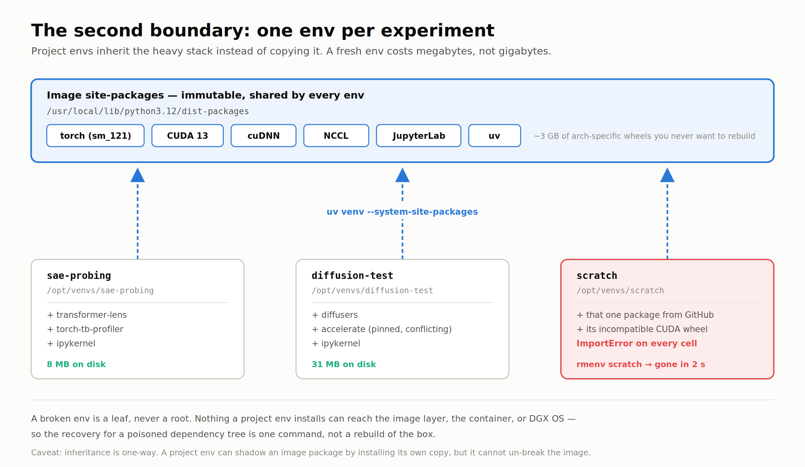
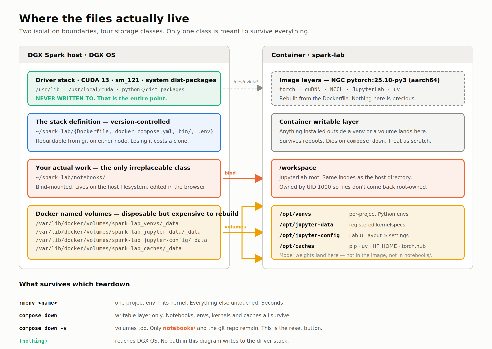

# Maximum Isolation: A Disposable JupyterLab for the DGX Spark

### A venv is not isolation on a machine whose entire value is its driver stack

---

The DGX Spark is a strange machine to own. It is small enough to sit on a desk and quiet enough to ignore, and it carries a GB10 Grace-Blackwell superchip with a CUDA stack that took NVIDIA real effort to get working on `sm_121` and aarch64. That stack is the product. The metal is just a delivery mechanism.

Which creates a specific anxiety the moment you open a notebook.

Notebook work is exploratory by nature. You read a paper on a Tuesday, you want to run the authors' code by Wednesday, and the authors pinned `torch==2.4.1+cu121` in a `requirements.txt` they last touched on an x86 workstation. You `pip install -r requirements.txt`, and now you are one dependency resolver away from a CUDA userspace that no longer matches the driver you are running against. On a laptop that is an afternoon. On the Spark it means reflashing DGX OS and rebuilding everything you spent a week tuning.

So the question I actually wanted answered was not "how do I run Jupyter on the Spark." It was: **how do I make it structurally impossible for a notebook to damage this machine?**

The answer turned out to have two boundaries, not one. This article is the reasoning and the complete implementation.

---

## What the Spark already gives you, and why it is not enough

DGX OS ships a JupyterLab launcher inside the DGX Dashboard service, reachable on port `11000`. It is genuinely convenient. You point it at a working directory, it creates a Python virtual environment there, it writes a `requirements.txt` documenting what you installed, it assigns you a port out of `/opt/nvidia/dgx-dashboard-service/jupyterlab_ports.yaml`, and it manages the server process lifecycle for you. Multiple users, multiple projects, separate environments. Zero setup.

For a lot of people that is the right tool and this article is unnecessary.

But read what it actually isolates. Each working directory gets **a venv on the host filesystem**. There is no container anywhere in that picture. A venv is a `sys.path` trick with a `pyvenv.cfg` file. It shields your system `dist-packages` from a stray `pip install`, and that is the complete extent of its protection.

Things a venv does not stop:

- A wheel that vendors its own CUDA userspace libraries and wins the `LD_LIBRARY_PATH` race
- Anything that wants `apt-get install` to satisfy a build dependency
- A package that writes to `~/.config`, `~/.local`, or `~/.cache` and corrupts shared state
- A `setup.py` that compiles against the wrong toolchain and leaves artifacts behind
- Anything running as root because a Stack Overflow answer said `sudo pip` would fix it

On a general-purpose Linux box, none of those are catastrophic. On a machine whose value proposition is a working `sm_121` stack, several of them are.

The venv is protecting the wrong boundary. It defends system Python. What needs defending is the driver and CUDA userspace beneath it.

---

## Two boundaries

The design I landed on stacks two independent layers, each with a different job.

**Layer one is a container.** The CUDA runtime, PyTorch, cuDNN, NCCL, and JupyterLab live inside an NGC image. The host contributes exactly one thing: the kernel driver, reached through `/dev/nvidia*` via the NVIDIA container runtime. Nothing installed inside the container can write to DGX OS. This is not a policy or a convention I have to remember; it is a namespace boundary the kernel enforces.

**Layer two is a per-project virtual environment inside the container.** Each experiment gets its own env under `/opt/venvs`, created with `--system-site-packages` so it inherits the image's torch and CUDA stack rather than reinstalling it. Break one project's dependency tree and you delete that env. The other projects, the notebook server, and the image are untouched.

That second layer is the part people skip, and skipping it is why containerized notebooks often feel worse than the host. If your only unit of isolation is the container, then every broken dependency costs you a rebuild, and rebuilds are slow enough that you start installing things sloppily to avoid them. Making the *inner* unit disposable is what keeps the outer one stable.

The inheritance is what makes it cheap. A fresh env is roughly 8 MB, because torch is not in it — torch is visible through `--system-site-packages`, sitting in the image where it belongs.



There is one caveat worth stating plainly: inheritance is one-way. A project env can *shadow* an image package by installing its own copy, which is often exactly what you want. It cannot repair the image. If you break the image, you rebuild the image — but that is a `docker compose build`, not a reflash.

---

## Where the files are stored

This is the part I would have wanted spelled out before I started, so it gets its own section rather than a footnote. Four storage classes, each with a different lifetime, and knowing which is which is what lets you delete things confidently.



**Class 1: the driver stack on the host.** `/usr/lib`, `/usr/local/cuda`, system `dist-packages`. Nothing in this design writes here. That is the whole objective.

**Class 2: the stack definition.** `~/spark-lab/` on the host — `Dockerfile`, `docker-compose.yml`, `bin/`, `.env`. Version-controlled, rebuildable from a clone on either node. Losing it costs you a `git clone`.

**Class 3: your notebooks.** `~/spark-lab/notebooks/` on the host, bind-mounted to `/workspace` in the container. Same inodes, not a copy. You edit them in a browser but they are host files, so `rsync`, `git`, and your existing backup all work on them without knowing Docker exists. This is the only irreplaceable class in the entire system.

**Class 4: everything else — Docker named volumes.** Four of them, living under `/var/lib/docker/volumes/spark-lab_*/_data`:

| Volume | Mounted at | Holds |
|---|---|---|
| `venvs` | `/opt/venvs` | per-project Python environments |
| `jupyter-data` | `/opt/jupyter-data` | registered kernelspecs |
| `jupyter-config` | `/opt/jupyter-config` | JupyterLab layout and settings |
| `caches` | `/opt/caches` | pip, uv, `HF_HOME`, `torch.hub` |

Disposable in principle, expensive to rebuild in practice — that `caches` volume is where model weights land. Keeping them in a named volume rather than in `notebooks/` matters more than it sounds: it means your notebook directory stays small enough to `git commit` and `rsync` without thinking about it, while a 40 GB checkpoint sits somewhere you will never accidentally sync.

There is also a fifth thing that is easy to forget: **the container's own writable layer**. Anything you install outside a venv and outside a volume lands there. It survives reboots, because `restart: unless-stopped` restarts the container rather than recreating it. It dies on `docker compose down`. Treat it as scratch space and do not put anything there you would miss.

The practical payoff is a graded recovery ladder:

| Command | What you lose | How long |
|---|---|---|
| `rmenv <name>` | one project's env and kernel | seconds |
| `docker compose up -d --force-recreate` | the container writable layer | ~10 s |
| `docker compose down && up --build` | writable layer, plus image rebuild | minutes |
| `docker compose down -v` | all volumes: envs, kernels, caches | minutes + re-download |
| *(no command)* | DGX OS | not reachable from here |

Almost every real failure is handled by the first row.

---

## The shape of the thing

Before the code, here is what you are actually building. Six files in one directory on the Spark:

```
~/spark-lab/
├── Dockerfile              # what goes INSIDE the container
├── docker-compose.yml      # how that container is WIRED UP
├── .env                    # your token, ports, UID — you create this
├── .env.example            # the template it gets copied from
├── bin/
│   ├── newenv              # create a project env + register its kernel
│   ├── lsenv               # list envs and their disk cost
│   └── rmenv               # delete an env and unregister its kernel
└── notebooks/              # your work. bind-mounted into the container
```

The two-file split is worth internalising, because it is not obvious the first time and it determines which command you reach for later:

- **`Dockerfile`** answers *"what does this machine look like?"* — base image, system packages, Python packages, which user runs things. Everything inside the boundary.
- **`docker-compose.yml`** answers *"how is this machine wired up?"* — which GPU it gets, which host directories are mounted where, which port is published, what happens on reboot. Everything crossing the boundary.

You never invoke the Dockerfile directly. Compose reads it: the `build: context: .` block at the top of the YAML means "the image for this service is built from the Dockerfile in this directory." Two commands cover the whole lifecycle:

```bash
docker compose build     # reads Dockerfile  → builds the image
docker compose up -d     # reads compose.yml → starts the container
```

And they get used at different frequencies, which is the practical reason to keep the concerns separate. Change the Dockerfile and you need `docker compose up -d --build`, which is minutes. Change only the YAML — a port, a volume, a memory limit — and plain `docker compose up -d` is enough: Compose notices the config drifted, recreates the container, and you are back in a couple of seconds. Most of the tuning you will do after week one is YAML-side, and it is nearly free.

Both files follow. Filenames matter: `docker compose` looks for `docker-compose.yml` by that exact name in the current directory.

---

## The image — `Dockerfile`

`nvcr.io/nvidia/pytorch:25.10-py3` is the tag NVIDIA currently points DGX Spark users toward for GB10 — CUDA 13, Python 3.12, `sm_121`, aarch64. Check the NGC catalog for something newer before you build, but **pin it explicitly**. Tracking a floating tag on a machine with architecture support this specific is how you discover on a Thursday morning that last night's `docker compose pull` grabbed an image that no longer includes your compute capability.

```dockerfile
# syntax=docker/dockerfile:1.7
ARG BASE_IMAGE=nvcr.io/nvidia/pytorch:25.10-py3
FROM ${BASE_IMAGE}

ARG DEV_USER=dev
ARG DEV_UID=1000
ARG DEV_GID=1000

SHELL ["/bin/bash", "-o", "pipefail", "-c"]
ENV DEBIAN_FRONTEND=noninteractive

RUN apt-get update && apt-get install -y --no-install-recommends \
        ca-certificates curl git git-lfs htop less nano rsync tmux \
    && rm -rf /var/lib/apt/lists/*

# JupyterLab and uv live in the IMAGE, never in a project venv, so that
# nuking a project env can never take the notebook server with it.
RUN pip install --no-cache-dir \
        "jupyterlab>=4.4,<5" \
        jupyterlab-nvdashboard \
        jupyter-resource-usage \
        ipywidgets \
        uv

# UID/GID match the host account that owns ./notebooks
RUN if ! getent group "${DEV_GID}" >/dev/null; then groupadd -g "${DEV_GID}" "${DEV_USER}"; fi \
 && if ! getent passwd "${DEV_UID}" >/dev/null; then \
        useradd -m -u "${DEV_UID}" -g "${DEV_GID}" -s /bin/bash "${DEV_USER}"; \
    fi

RUN mkdir -p /opt/venvs /opt/jupyter-data /opt/jupyter-config \
             /opt/caches/{pip,uv,hf,torch} /workspace \
 && chown -R "${DEV_UID}:${DEV_GID}" \
        /opt/venvs /opt/jupyter-data /opt/jupyter-config /opt/caches /workspace

COPY --chmod=0755 bin/newenv bin/lsenv bin/rmenv /usr/local/bin/

ENV VENV_ROOT=/opt/venvs \
    JUPYTER_DATA_DIR=/opt/jupyter-data \
    JUPYTER_CONFIG_DIR=/opt/jupyter-config \
    PIP_CACHE_DIR=/opt/caches/pip \
    UV_CACHE_DIR=/opt/caches/uv \
    UV_LINK_MODE=copy \
    HF_HOME=/opt/caches/hf \
    TORCH_HOME=/opt/caches/torch \
    PYTHONDONTWRITEBYTECODE=1 \
    PIP_DISABLE_PIP_VERSION_CHECK=1

USER ${DEV_USER}
WORKDIR /workspace
EXPOSE 8888

# The NGC entrypoint (/opt/nvidia/nvidia_entrypoint.sh) is inherited on
# purpose — it sets up the CUDA environment and execs CMD. Do not override it.
CMD ["jupyter", "lab", \
     "--ip=0.0.0.0", \
     "--port=8888", \
     "--no-browser", \
     "--ServerApp.root_dir=/workspace"]
```

Four decisions in there are load-bearing:

**The `mkdir` and `chown` before the volumes exist.** Docker seeds an empty named volume from whatever is at that path in the image, ownership included. Create the directories owned by `dev` at build time and the volumes come up writable by `dev` on first run. Skip it and you spend an hour wondering why `newenv` gets permission denied.

**`USER dev` with a matching host UID.** Bind-mounted files carry numeric ownership across the boundary, not names. If the container writes as root, your notebooks come back root-owned on the host and every subsequent `git commit` needs `sudo`. Matching UID 1000 makes the boundary invisible.

It also has a pleasant side effect: as a non-root user you *cannot* pip install into the image's `dist-packages`. The design enforces itself.

**Keeping JupyterLab and `uv` in the image.** They are infrastructure, not project dependencies. Putting them in the image means a project env can never break the server that runs it.

**Not overriding `ENTRYPOINT`.** NGC images ship `/opt/nvidia/nvidia_entrypoint.sh`, which sets up the CUDA environment and then `exec`s your `CMD`. Replacing it with `tini` or a custom script is a classic way to get a container that starts fine and then cannot see the GPU. Use Compose's `init: true` instead if you want proper signal handling.

---

## The wiring — `docker-compose.yml`

Save this next to the Dockerfile, under exactly that name. Nothing here describes what is installed; every line is about how the container meets the host.

```yaml
name: spark-lab

services:
  lab:
    build:
      context: .
      args:
        BASE_IMAGE: ${BASE_IMAGE:-nvcr.io/nvidia/pytorch:25.10-py3}
        DEV_UID: ${DEV_UID:-1000}
        DEV_GID: ${DEV_GID:-1000}
    image: spark-lab:local
    container_name: spark-lab
    hostname: spark-lab

    restart: unless-stopped
    init: true

    deploy:
      resources:
        reservations:
          devices:
            - driver: nvidia
              count: all
              capabilities: [gpu]

    environment:
      NVIDIA_VISIBLE_DEVICES: all
      NVIDIA_DRIVER_CAPABILITIES: compute,utility
      JUPYTER_TOKEN: ${JUPYTER_TOKEN:?set JUPYTER_TOKEN in .env}
      PYTORCH_CUDA_ALLOC_CONF: expandable_segments:True

    ports:
      - "${BIND_ADDR:-127.0.0.1}:${HOST_PORT:-8888}:8888"

    volumes:
      - ./notebooks:/workspace
      - venvs:/opt/venvs
      - jupyter-data:/opt/jupyter-data
      - jupyter-config:/opt/jupyter-config
      - caches:/opt/caches

    shm_size: "16gb"

    ulimits:
      memlock: -1
      stack: 67108864

    healthcheck:
      test: ["CMD", "curl", "-fsS", "http://localhost:8888/api/status"]
      interval: 30s
      timeout: 5s
      retries: 3
      start_period: 120s

    logging:
      driver: json-file
      options:
        max-size: "10m"
        max-file: "3"

volumes:
  venvs:
  jupyter-data:
  jupyter-config:
  caches:
```

`shm_size: "16gb"` is not optional. Docker's default `/dev/shm` is 64 MB, PyTorch DataLoader workers communicate through shared memory, and the failure mode is a `Bus error` several minutes into a training run with no obvious cause. Set it once and never debug it.

`PYTORCH_CUDA_ALLOC_CONF: expandable_segments:True` earns its place on this machine specifically. GB10 uses unified LPDDR5X shared between CPU and GPU. Notebook sessions where you load and reload models repeatedly are exactly the fragmentation-heavy pattern expandable segments were built for.

`restart: unless-stopped` deserves a note, because it interacts with the storage model in a way that surprises people. It restarts the container, it does not recreate it. So an ad-hoc `pip install` in the container's writable layer survives a reboot. Usually convenient. Occasionally the reason a colleague cannot reproduce your notebook.

The **top-level `volumes:` block** at the bottom is not decoration. Docker only manages a named volume you have declared, so every name used in the service's mount list has to appear there too. Omit one and Compose refuses to start with a fairly cryptic message about an undefined volume.

And `JUPYTER_TOKEN: ${JUPYTER_TOKEN:?set JUPYTER_TOKEN in .env}` is deliberately unforgiving. The `:?` form makes Compose **abort with an error** if the variable is unset, rather than substituting an empty string. An empty `JUPYTER_TOKEN` means JupyterLab starts with authentication disabled — on `0.0.0.0`, on your LAN. Failing loudly is the correct behaviour here, so `.env` is a required file, not an optional convenience:

```bash
cp .env.example .env
sed -i "s/^JUPYTER_TOKEN=.*/JUPYTER_TOKEN=$(openssl rand -hex 32)/" .env
```

Compose picks up `.env` automatically from the directory you run it in. Keep it out of git — the `.gitignore` in the repo already does that.

---

## The helper scripts

Three small wrappers that make the second boundary cheap enough to actually use. They live in `bin/` and get copied to `/usr/local/bin`.

`newenv` creates a project env and registers it as a Jupyter kernel:

```bash
#!/usr/bin/env bash
set -euo pipefail
VENV_ROOT=${VENV_ROOT:-/opt/venvs}

[[ $# -ge 1 ]] || { echo "usage: newenv <name> [pip-package ...]" >&2; exit 64; }
NAME=$1; shift
[[ $NAME =~ ^[A-Za-z0-9][A-Za-z0-9._-]*$ ]] || { echo "invalid name" >&2; exit 64; }

VENV="$VENV_ROOT/$NAME"
if [[ -d $VENV ]]; then
    echo "newenv: reusing existing env $VENV"
else
    uv venv --system-site-packages --python "$(command -v python3)" "$VENV"
fi

export VIRTUAL_ENV="$VENV"
uv pip install --quiet ipykernel "$@"

"$VENV/bin/python" -m ipykernel install \
    --user --name "$NAME" --display-name "Python ($NAME)"
```

`ipykernel install --user` writes into `JUPYTER_DATA_DIR`, which we pointed at `/opt/jupyter-data` — a named volume. So registered kernels survive image rebuilds. Rebuild the image to pick up a newer NGC release and your kernels are all still there.

`rmenv` is the one that matters:

```bash
#!/usr/bin/env bash
set -euo pipefail
VENV_ROOT=${VENV_ROOT:-/opt/venvs}
NAME=${1:?usage: rmenv <name>}
VENV="$VENV_ROOT/$NAME"
[[ -d $VENV ]] || { echo "no such env: $VENV" >&2; exit 1; }

jupyter kernelspec remove -f "$NAME" 2>/dev/null || true
rm -rf "$VENV"
```

And `lsenv` tells you what you have accumulated and what it costs:

```bash
#!/usr/bin/env bash
set -euo pipefail
VENV_ROOT=${VENV_ROOT:-/opt/venvs}
printf '%-24s %10s  %s\n' NAME SIZE PYTHON
for venv in "$VENV_ROOT"/*/; do
    [[ -x "${venv}bin/python" ]] || continue
    printf '%-24s %10s  %s\n' \
        "$(basename "$venv")" \
        "$(du -sh "$venv" 2>/dev/null | cut -f1)" \
        "$("${venv}bin/python" --version 2>&1)"
done
```

---

## Bringing it up

```bash
git clone <your-repo> ~/spark-lab && cd ~/spark-lab

cp .env.example .env
sed -i "s/^JUPYTER_TOKEN=.*/JUPYTER_TOKEN=$(openssl rand -hex 32)/" .env
sed -i "s/^DEV_UID=.*/DEV_UID=$(id -u)/;s/^DEV_GID=.*/DEV_GID=$(id -g)/" .env

mkdir -p notebooks

docker login nvcr.io          # $oauthtoken / <NGC API key>
docker compose build          # first build pulls ~20 GB
docker compose up -d
docker compose logs -f lab
```

If you typed the files out rather than cloning, the only extra step is making the helpers executable before the build, since `COPY --chmod=0755` sets the mode inside the image but `git` is what would normally preserve it on the way in:

```bash
mkdir -p ~/spark-lab/bin ~/spark-lab/notebooks
# save Dockerfile, docker-compose.yml, .env.example into ~/spark-lab/
# save newenv, lsenv, rmenv into ~/spark-lab/bin/
chmod +x ~/spark-lab/bin/*
```

A note if you administer this box through **Portainer**: its UI calls Compose files "Stacks", and you can paste this YAML straight into the stack editor — but the `build:` block needs a build context Portainer can reach, so you would point the stack at a Git repository rather than pasting. Building from a pasted editor buffer has no directory to find the Dockerfile in. On the command line this problem does not exist, which is why I run it there.

Reaching it from another machine on the LAN is a `BIND_ADDR` decision. `0.0.0.0` puts JupyterLab on your network with the token as the only gate — fine on a trusted home lab, and the reason the token is 32 random bytes rather than something memorable. If you would rather not, set `BIND_ADDR=127.0.0.1` and tunnel:

```bash
ssh -N -L 8888:localhost:8888 user@spark
```

I use `8888` deliberately, to stay clear of the DGX Dashboard on `11000` and the per-user JupyterLab ports it hands out. If you run both, keep them apart.

Then, in a notebook, confirm the whole chain actually works end to end:

```python
import torch
print(torch.__version__, torch.version.cuda)
print(torch.cuda.is_available(), torch.cuda.get_device_name(0))
print(torch.cuda.get_device_capability(0))   # expect (12, 1) on GB10
x = torch.randn(8192, 8192, device="cuda"); print((x @ x).sum().item())
```

---

## The workflow this produces

Open a terminal inside JupyterLab and the loop is:

```bash
newenv sae-probing transformer-lens torch-tb-profiler
lsenv
rmenv sae-probing
```

Reload the browser tab, and `Python (sae-probing)` appears in the launcher. Every `!pip install` in a notebook on that kernel goes into that env alone.

One env per experiment. Because a fresh env is 8 MB and two seconds, the cost of creating one is genuinely lower than the cost of thinking about whether this particular install is safe to put in an existing one. That is the actual goal — not the isolation itself, but making the isolated path the lazy path. Any safety mechanism that requires discipline gets abandoned around week three.

The failure I now have is: a notebook throws `ImportError` on every cell because a package I pulled off GitHub dragged in an incompatible wheel. The recovery is `rmenv scratch && newenv scratch`, and I am back in under ten seconds, having lost nothing.

The failure I used to worry about — the one where a dependency resolver quietly replaces a CUDA library and I discover it three days later when a training run produces silent garbage — is not in the state space anymore. There is no path from a notebook cell to `/usr/local/cuda`.

---

## What this costs

Being honest about the trade-offs, since every isolation scheme has some:

- **~20 GB for the base image**, and a slow first build. You pay it once per node.
- **Two hops for a permanent dependency.** Something you want in *every* env belongs in the Dockerfile, which means a rebuild. In practice this is rare, and rare is the correct frequency for touching the base layer.
- **`--system-site-packages` is not perfect isolation.** A project env can shadow an image package but shares its `sys.path` tail. If you need a genuinely different torch build, that is a separate image, not a venv. This design optimizes for the common case — the same CUDA stack, wildly different Python packages on top — which is what notebook work actually looks like.
- **Named volumes are invisible until you look for them.** `docker system df -v` occasionally, or `caches` grows without bound.

Against that: the machine stays exactly as NVIDIA shipped it, indefinitely, no matter what I run.

For a box whose value is a working `sm_121` stack, that is a trade I will take every time.

---

*Running the same thing on a second node needs nothing but a different `HOST_PORT` and token in `.env`. The image builds identically — nothing in this design is node-specific.*
