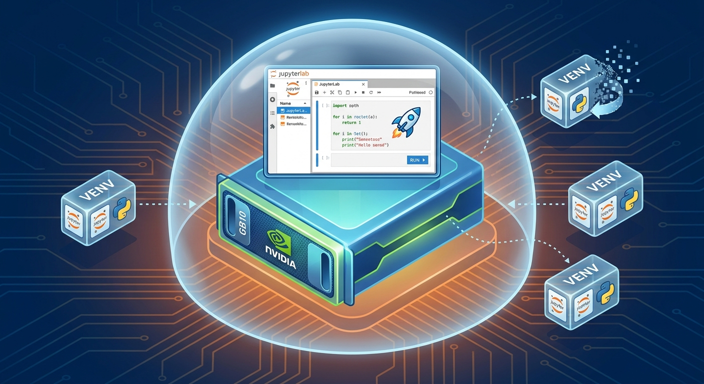

# spark-lab — disposable JupyterLab for DGX Spark (GB10)

[](LICENSE)
[](docker-compose.yml)
[](https://jupyterlab.readthedocs.io/)
[](https://developer.nvidia.com/cuda-toolkit)
[-76B900)](https://www.nvidia.com/en-us/products/workstations/dgx-spark/)



( ** Full story for free on medium: ** https://medium.com/@michael.hannecke/maximum-isolation-a-disposable-jupyterlab-for-the-dgx-spark-b08b2a939da6 )
A containerized JupyterLab for the Spark, built so that `pip install` in a notebook
can never reach DGX OS. Two layers of isolation:

1. **Container** — the CUDA/PyTorch stack and JupyterLab live in an NGC image.
   Nothing you install lands on the host.
2. **Per-project venv inside the container** — each notebook project gets its own
   env under `/opt/venvs`, created with `--system-site-packages` so it inherits
   torch/cuDNN/NCCL from the image instead of pulling a 3 GB wheel that would
   likely be built for the wrong arch. Trash one env without touching the others.


---

## Why not the built-in one?

DGX OS ships a JupyterLab launcher in the DGX Dashboard service (port `11000`).
It creates a venv per working directory (default `~/jupyterlab`) with a
`requirements.txt`, and assigns per-user ports from
`/opt/nvidia/dgx-dashboard-service/jupyterlab_ports.yaml`.

That is **venv-level isolation on the host filesystem, not container isolation**.
It protects your system `dist-packages` and nothing else. Anything that pulls its
own CUDA/cuDNN userspace wheels, wants `apt`, or writes outside the venv still hits
the base system — and on GB10 the sm_121 stack is exactly the thing you do not
want to have to rebuild. Hence this.

---

## Layout

Two files do two different jobs, and it decides which command you need later:

```
~/spark-lab/
├── Dockerfile              # what goes INSIDE the container (base image, packages, user)
├── docker-compose.yml      # how it is WIRED UP (GPU, mounts, ports, restart policy)
├── .env                    # token, ports, UID -- you create this, gitignored
├── .env.example            # template
├── bin/{newenv,lsenv,rmenv}
└── notebooks/              # your work, bind-mounted to /workspace
```

You never run the Dockerfile directly. Compose reads it via the `build: context: .`
block. Change the Dockerfile -> `docker compose up -d --build` (minutes).
Change only the YAML -> `docker compose up -d` (seconds, no rebuild).

`docker compose` looks for `docker-compose.yml` by that exact filename in the
current directory, so keep the name.

---

## Quickstart

```bash
# on the Spark
git clone <wherever-you-put-this> ~/spark-lab && cd ~/spark-lab

cp .env.example .env
sed -i "s/^JUPYTER_TOKEN=.*/JUPYTER_TOKEN=$(openssl rand -hex 32)/" .env
sed -i "s/^DEV_UID=.*/DEV_UID=$(id -u)/;s/^DEV_GID=.*/DEV_GID=$(id -g)/" .env

mkdir -p notebooks

docker login nvcr.io          # $oauthtoken / <NGC API key>, if not already done
docker compose build          # first build pulls ~20 GB, go make an espresso
docker compose up -d

docker compose logs -f lab    # wait for "Jupyter Server ... is running"
```

---

## Reaching it from another machine

Two binds in the chain -- conflating them is the usual source of confusion:

```
[Jupyter] --> [container :8888] --> [Spark BIND_ADDR:HOST_PORT] --> [laptop]
 --ip=0.0.0.0                        set in .env
 (Dockerfile, always 0.0.0.0,        (the actual security decision)
  not a security setting)
```

`--ip=0.0.0.0` inside the container means "all interfaces of the container", a
namespace nothing can route to. Set it to 127.0.0.1 and the published port has
nothing to forward to.

**Option A -- LAN.** `BIND_ADDR=0.0.0.0` in `.env`, then:

```
http://spark-01.local:8888/lab?token=<token>
```

Token is the only gate and it crosses the wire in clear HTTP. Fine on a trusted
home LAN; not fine anywhere with guest wifi or unmanaged devices.

**Option B -- SSH tunnel (preferred).** `BIND_ADDR=127.0.0.1`, so the port exists
only on the Spark's loopback. Then from the laptop:

```bash
ssh -N -L 8888:127.0.0.1:8888 michael@spark-01.local
# -N            no remote command, just the tunnel
# left  8888    port opened on YOUR machine
# 127.0.0.1:8888  destination as resolved ON THE SPARK -- use the literal IP,
#                 NOT "localhost": that may resolve to ::1 on the Spark while
#                 Docker published IPv4 only, and ssh reports no error at all.
# spark-01.local  use the .local (mDNS) name from a Mac. Bare "spark-01" needs
#                 your router to publish DHCP hostnames into DNS; many do not.
# -> http://localhost:8888/lab?token=...

Diagnostic worth memorising: `ssh -N` that WORKS produces no output and looks
frozen. `ssh -N` that returns immediately to the prompt has failed -- almost
always hostname resolution. Check with `ping spark-01` before debugging forwards.
```

Nicer, via `~/.ssh/config` on the laptop:

```
Host spark-lab
    HostName spark-01.local
    User michael
    LocalForward 8888 127.0.0.1:8888
    ExitOnForwardFailure yes      # fail loudly if 8888 is already bound locally
    ServerAliveInterval 30        # survive idle / sleep
    ServerAliveCountMax 3
```

Then `ssh -N spark-lab` (or `ssh -fN` to background, `autossh -M 0 -fN` to survive
sleep). With VS Code Remote-SSH, 8888 is auto-forwarded and no tunnel is needed.

Token:

```bash
grep JUPYTER_TOKEN .env
# or ask the running container:
docker compose exec lab printenv JUPYTER_TOKEN
```

It is NOT in `docker compose logs`. Jupyter only prints a token-bearing URL when it
generated the token itself; when the token comes from config/env it masks the value
as a literal `token=...` (see the `# Don't log full token if it came from config`
branch in jupyter_server/serverapp.py). The three dots are intentional, not a bug.

---

## Daily workflow

Open a terminal **inside JupyterLab** (or `docker compose exec lab bash`), then:

```bash
newenv sae-probing torch-tb-profiler transformer-lens   # create env + register kernel
newenv scratch                                          # empty one for messing about
lsenv                                                   # what exists, how fat
rmenv scratch                                           # gone, kernel unregistered
```

Reload the browser tab and the new kernel shows up in the launcher as
`Python (sae-probing)`.

Inside a notebook running on that kernel, `!pip install <pkg>` goes into that
env only. If you prefer to be explicit:

```python
!/opt/venvs/sae-probing/bin/python -m pip install <pkg>
```

**Rule of thumb:** one env per experiment. They're cheap — `--system-site-packages`
means a fresh env is a few MB, not gigabytes.

---

## Blast radius

| You break | Recovery |
|---|---|
| One project's deps | `rmenv <name> && newenv <name> ...` — seconds |
| The container's writable layer | `docker compose up -d --force-recreate` — envs, caches, notebooks survive (named volumes) |
| Everything, including envs | `docker compose down -v && docker compose up -d --build` — only `./notebooks` survives, which is the point |
| DGX OS | Not reachable from here. That's the whole exercise. |

---

## What persists where


| Path in container | Backing | Survives `down` | Survives `down -v` |
|---|---|---|---|
| `/workspace` | bind-mount `./notebooks` | yes | yes |
| `/opt/venvs` | named volume `venvs` | yes | no |
| `/opt/jupyter-data` | named volume (kernelspecs) | yes | no |
| `/opt/jupyter-config` | named volume (Lab UI state) | yes | no |
| `/opt/caches` | named volume (pip/uv/HF/torch) | yes | no |

`HF_HOME` points at `/opt/caches/hf`, so model downloads are shared across every
env and survive rebuilds. If you already have a populated HF cache on the host,
swap that volume for a bind-mount and skip re-downloading:

```yaml
      - /home/michael/.cache/huggingface:/opt/caches/hf
```

---

## Notes specific to this box

- **Pin the base image.** `nvcr.io/nvidia/pytorch:25.10-py3` is what NVIDIA points
  DGX Spark users at for GB10 (CUDA 13, Python 3.12, sm_121, aarch64). Check the
  NGC catalog for a newer tag before you build, and set it in `.env` — never track
  a floating tag on a machine where the arch support is this specific.
- **Ports.** `8888` deliberately avoids the DGX Dashboard on `11000` and the
  per-user JupyterLab ports it hands out. If you run both, keep them apart.
- **`shm_size: 16gb`.** Docker's 64 MB default kills multi-worker DataLoaders.
- **Unified memory.** GB10 shares LPDDR5X between CPU and GPU, so a runaway
  notebook can starve the host. If you're also running vLLM on the same node,
  consider adding `mem_limit:` to this service so a bad cell can't OOM your
  inference server.
- **Second node.** Same tree, different `.env` (`HOST_PORT`, token). The image
  builds identically on both; nothing here is node-specific.
- **Running two projects at once.** Copy the directory, change `name:` at the top
  of the compose file, `container_name`, and `HOST_PORT`. Named volumes are scoped
  by project name, so they won't collide.

---

## Updating the base image

```bash
# edit BASE_IMAGE in .env, then:
docker compose build --pull
docker compose up -d
lsenv    # your envs are still there, but --system-site-packages now points at
         # the NEW torch. If an env pinned something against the old ABI, rmenv/newenv it.
```

---

## Sanity check after first boot

In a notebook on any kernel:

```python
import torch
print(torch.__version__, torch.version.cuda)
print(torch.cuda.is_available(), torch.cuda.get_device_name(0))
print(torch.cuda.get_device_capability(0))   # expect (12, 1) on GB10
x = torch.randn(8192, 8192, device="cuda"); print((x @ x).sum().item())
```

---

## License

Released under the [MIT License](LICENSE). © 2026 Michael Hannecke.
